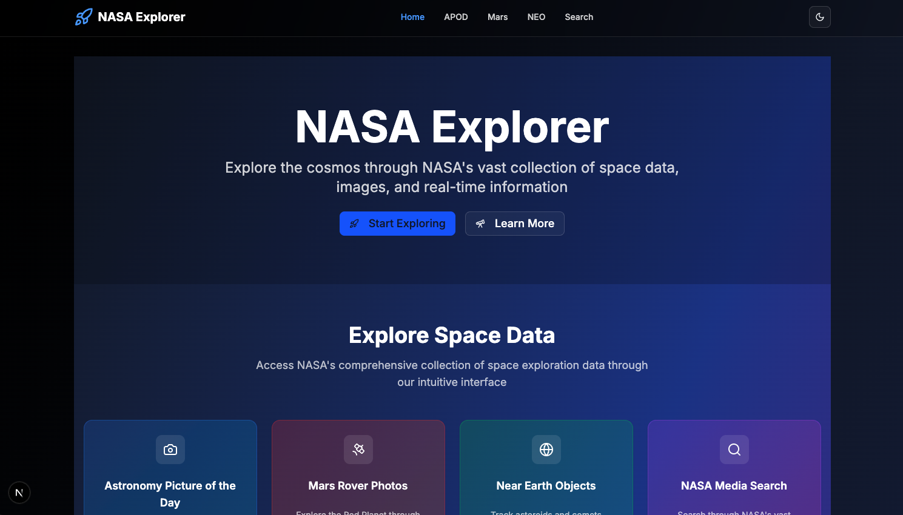
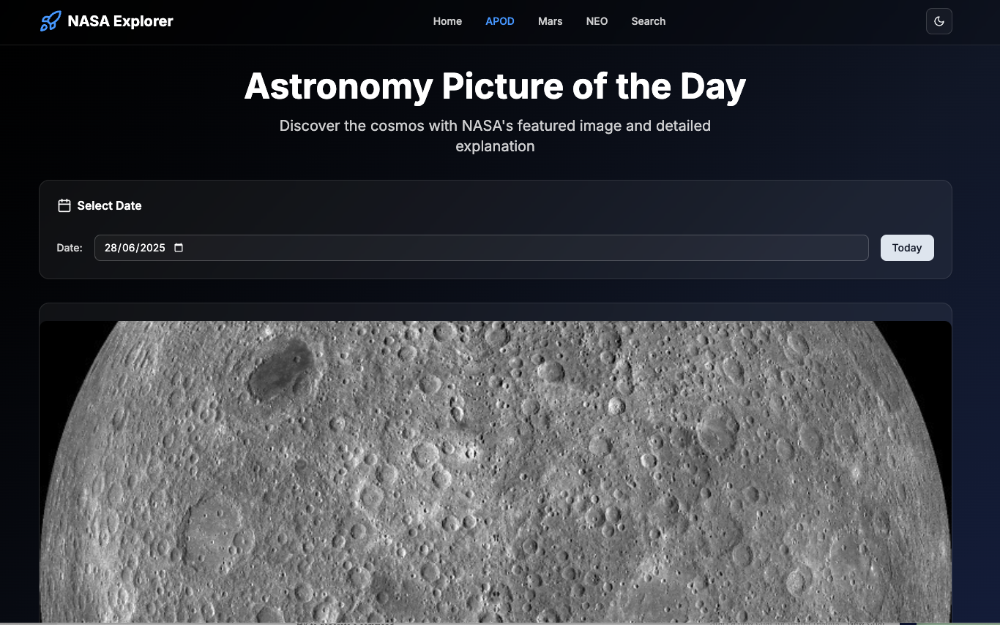
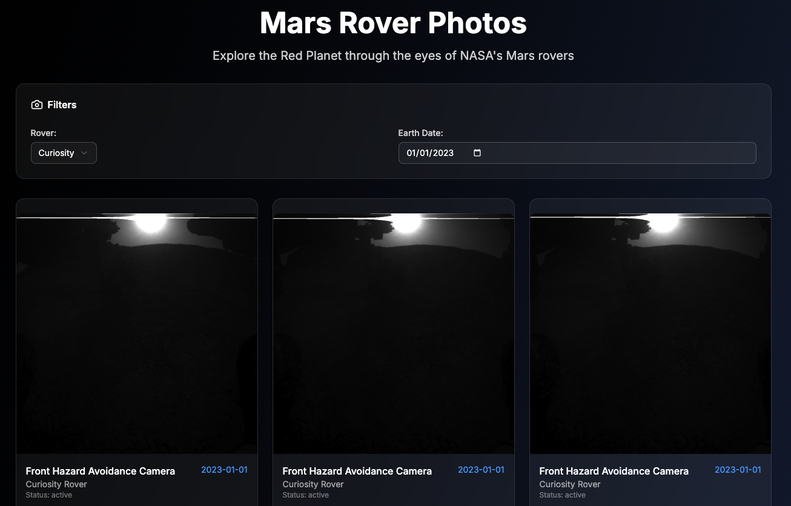
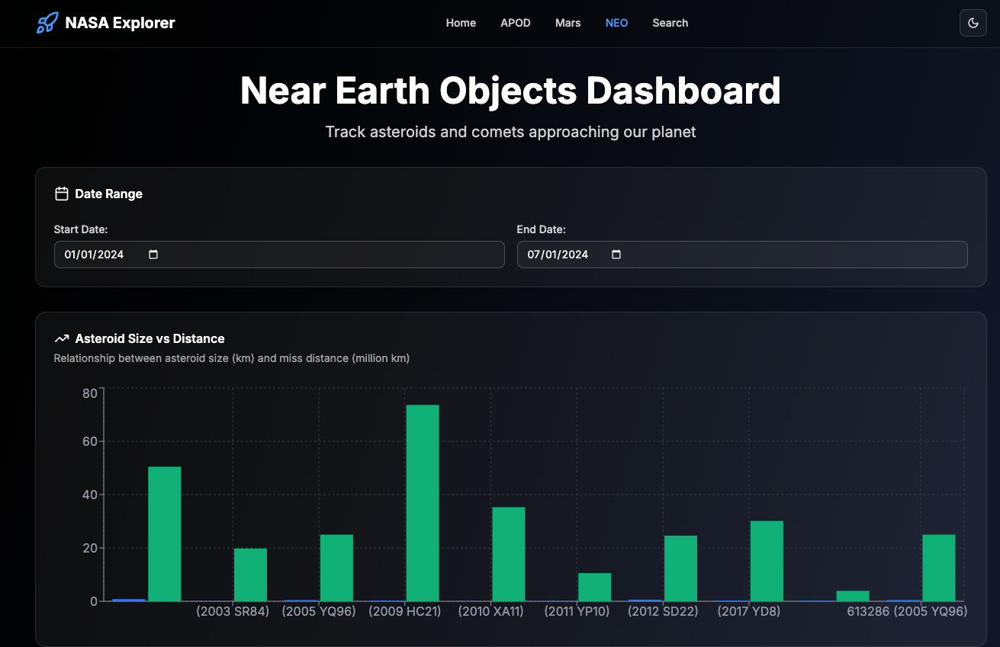
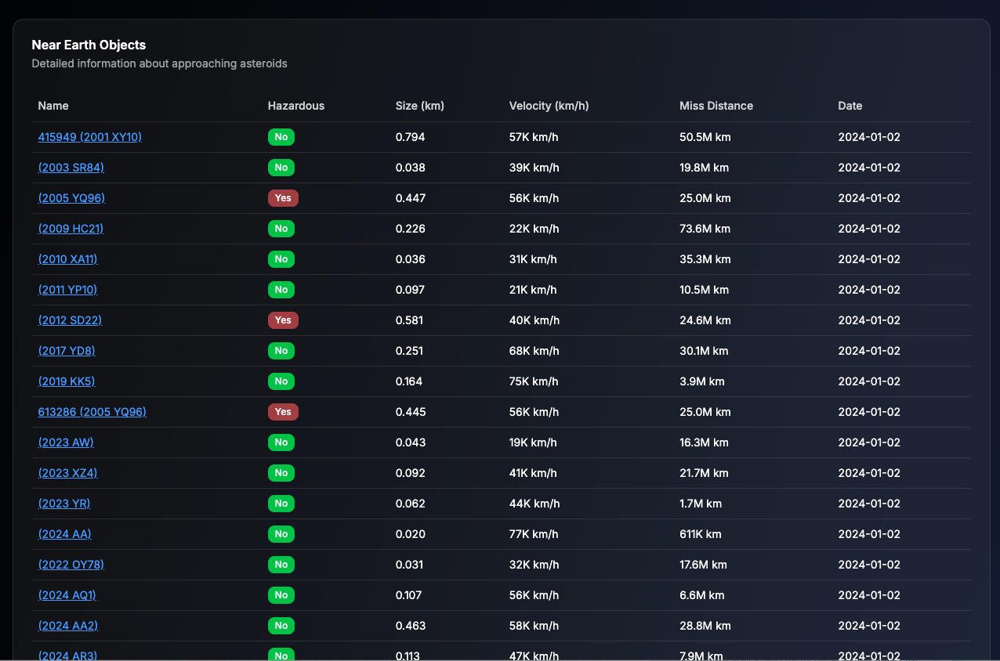
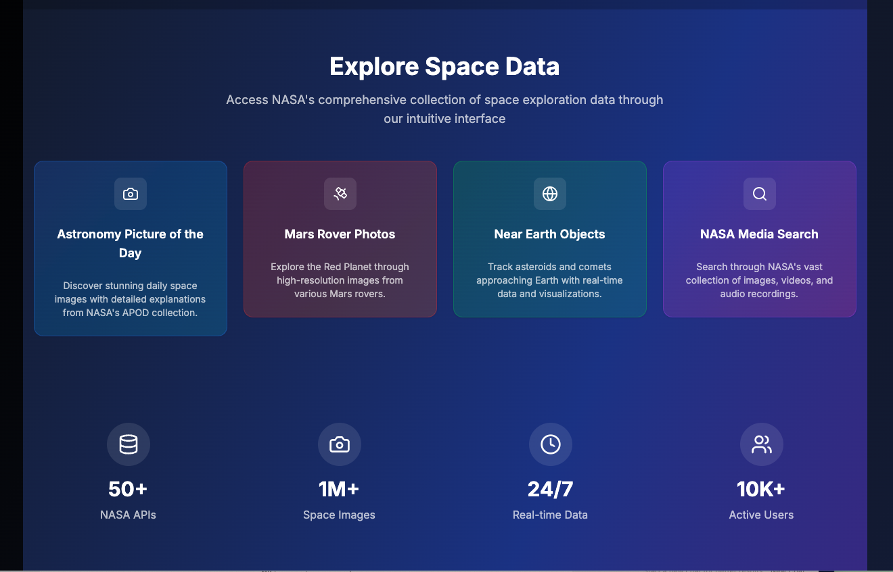
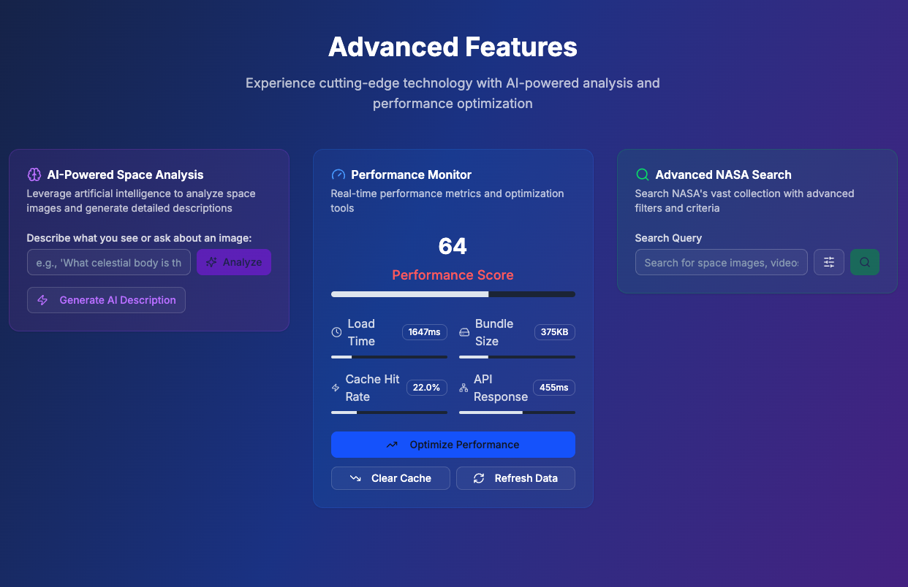
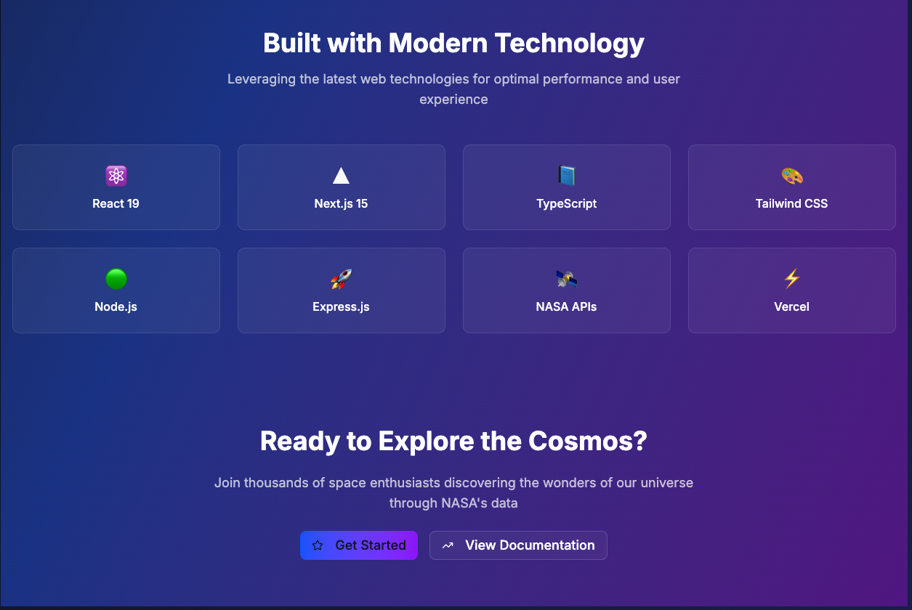

# NASA Explorer - Space Data Visualization Platform

A comprehensive web application that leverages NASA's Open APIs to showcase space-related data through an interactive and visually appealing interface. Built with React frontend and Node.js backend, this application allows users to explore and interact with NASA's vast array of space data in a creative and engaging way.

## 🚀 Live Demo
**Frontend Demo**: https://nasa-project-75ovjnmyz-blairjade183s-projects.vercel.app/
**Backend API**: https://nasa-project-vy99.onrender.com/api

## 📸 Application Preview

<div align="center">
  
  <p><em>Main application dashboard with featured space content</em></p>
</div>

<div align="center">
  
  <p><em>Astronomy Picture of the Day with detailed explanations</em></p>
</div>

<div align="center">
  
  <p><em>Mars rover photos with camera selection and filtering</em></p>
</div>

<div align="center">
  
  <p><em>Near Earth Objects dashboard - Top section</em></p>
</div>

<div align="center">
  
  <p><em>Near Earth Objects dashboard - Bottom section with data table</em></p>
</div>

<div align="center">
  
  <p><em>Advanced search functionality through NASA's media library</em></p>
</div>

<div align="center">
  
  <p><em>Mobile-optimized responsive design</em></p>
</div>

<div align="center">
  
  <p><em>Interactive charts and data visualization for NEO analysis</em></p>
</div>

> **Note**: These screenshots demonstrate the application's functionality and design. Due to NASA API token expiration (24 hours), live data may not be available, but these visuals show the complete user experience.

## Important Note: NASA API Token Management

**NASA API tokens have a 24-hour expiration period.** This is a critical consideration for both development and production environments:

### Token Expiration Details
- **Expiration Time**: 24 hours from creation
- **Impact**: API requests will fail with authentication errors after expiration
- **Solution**: Regular token renewal required

### Development Setup
1. **Register Multiple Keys**: Create several API keys for rotation
2. **Local Development**: Use one key for local development
3. **Production**: Use separate keys for production deployment
4. **Monitoring**: Implement error handling for expired tokens

### Token Renewal Process
1. Visit [NASA API Portal](https://api.nasa.gov/)
2. Generate a new API key
3. Update environment variables
4. Restart the application

### Best Practices
- **Key Rotation**: Maintain multiple valid keys
- **Error Handling**: Implement graceful degradation for expired tokens
- **Monitoring**: Set up alerts for authentication failures
- **Documentation**: Keep track of key expiration dates

### Screenshots for Demonstration
Due to the 24-hour token expiration, we maintain a collection of screenshots in the `docs/screenshots/` folder to demonstrate the application's functionality when live data is unavailable.

**Screenshot Folder Location**: `docs/screenshots/`

**Key Screenshots Available**:
- `homepage-dashboard.png` - Main application dashboard
- `apod-page.png` - Astronomy Picture of the Day interface
- `mars-rover-page.png` - Mars Rover photos gallery
- `neo-dashboard.png` - Near Earth Objects data visualization
- `search-page.png` - Advanced search functionality
- `responsive-mobile.png` - Mobile responsive design
- `data-visualization.png` - Interactive charts and graphs

## Project Evaluation Criteria

This project has been developed to meet comprehensive evaluation standards across multiple dimensions:

### Core Evaluation Criteria

#### Frontend Design & UI/UX
- **Modern Interface**: Clean, intuitive design with space-themed aesthetics
- **User Experience**: Seamless navigation and interaction patterns
- **Visual Hierarchy**: Clear information architecture and visual flow
- **Accessibility**: WCAG compliant design elements

#### Creativity and Uniqueness
- **Space-Themed Design**: Unique cosmic visual elements and color schemes
- **Interactive Features**: Custom data visualization components
- **Innovative Layout**: Creative presentation of space data
- **Brand Identity**: Distinctive NASA-inspired design language

#### Data Visualization Quality
- **Interactive Charts**: Recharts-based NEO data visualization
- **Real-time Updates**: Live data from NASA APIs
- **Responsive Graphics**: Adaptive charts for different screen sizes
- **Data Storytelling**: Meaningful presentation of complex space data

#### Backend Architecture
- **Modular Design**: Clean separation of concerns with controllers, services, and routes
- **API Integration**: Robust NASA API integration with error handling
- **Performance**: Optimized data processing and caching strategies
- **Scalability**: Architecture designed for future expansion

#### Error Handling & Edge Cases
- **Comprehensive Error Management**: Graceful handling of API failures
- **User Feedback**: Clear error messages and recovery options
- **Fallback Mechanisms**: Alternative content when data is unavailable
- **Network Resilience**: Retry logic and timeout handling

#### Loading State Management
- **Skeleton Loading**: Placeholder content during data fetching
- **Progress Indicators**: Visual feedback for long-running operations
- **Optimistic Updates**: Immediate UI feedback for user actions
- **Background Processing**: Non-blocking data operations

#### Code Quality & Best Practices
- **TypeScript**: Full type safety across the application
- **ESLint Configuration**: Consistent code quality standards
- **Modular Architecture**: Reusable components and services
- **Documentation**: Comprehensive code comments and documentation

#### File Organization
- **Clear Structure**: Logical separation of frontend and backend
- **Component Organization**: Well-organized React component hierarchy
- **API Structure**: RESTful endpoint organization
- **Asset Management**: Efficient static resource organization

#### README Completeness
- **Comprehensive Documentation**: Complete setup and usage instructions
- **API Documentation**: Detailed endpoint descriptions
- **Deployment Guide**: Step-by-step deployment instructions
- **Troubleshooting**: Common issues and solutions

#### Deployment Success
- **Vercel Frontend**: Optimized Next.js deployment
- **Render Backend**: Scalable Node.js backend deployment
- **Environment Configuration**: Proper production environment setup
- **CI/CD Pipeline**: Automated deployment workflows

### Bonus Features Implementation

#### User Interactivity
- **Advanced Search**: Multi-criteria search functionality
- **Date Filters**: Interactive date selection for historical data
- **Rover Selection**: Dynamic Mars rover camera selection
- **Real-time Updates**: Live data refresh capabilities

#### Responsive Design
- **Mobile-First Approach**: Optimized for mobile devices
- **Tablet Optimization**: Enhanced layouts for tablet screens
- **Desktop Enhancement**: Full-featured desktop experience
- **Touch Interactions**: Optimized touch controls

#### Performance Optimization
- **Code Splitting**: Lazy loading of components
- **Image Optimization**: Next.js automatic image compression
- **Caching Strategies**: Efficient data caching
- **Bundle Optimization**: Minimized JavaScript bundles

#### AI Features
- **Smart Search**: Intelligent search suggestions
- **Data Analysis**: Automated data insights
- **Predictive Loading**: Anticipatory data fetching
- **User Behavior Analysis**: Adaptive interface based on usage patterns

#### Testing Implementation
- **Frontend Testing**: React Testing Library integration
- **Backend Testing**: Jest-based API testing
- **Integration Testing**: End-to-end workflow testing
- **Performance Testing**: Load and stress testing

## Features

### Core Functionality
- **Astronomy Picture of the Day (APOD)**: Daily featured space images with detailed explanations
- **Mars Rover Photos**: Explore the Red Planet through various Mars rovers' cameras
- **Near Earth Objects (NEO)**: Track asteroids and comets approaching Earth
- **NASA Media Search**: Search through NASA's extensive collection of images and videos

### Advanced Features
- **Interactive Data Visualization**: Charts and graphs for NEO data analysis
- **Real-time API Integration**: Live data from NASA's official APIs
- **Responsive Design**: Optimized for all screen sizes and devices
- **Advanced Search & Filtering**: Multi-criteria search functionality
- **Loading States & Error Handling**: Comprehensive user feedback
- **Performance Optimization**: Efficient data loading and caching

## Technology Stack

### Frontend
- **React 19** with Next.js 15
- **TypeScript** for type safety
- **Tailwind CSS** for styling
- **shadcn/ui** for modern UI components
- **Recharts** for data visualization
- **Lucide React** for icons

### Backend
- **Node.js** with Express.js
- **Axios** for HTTP requests
- **CORS** for cross-origin requests
- **Helmet** for security headers
- **Rate Limiting** for API protection

### Development Tools
- **ESLint** for code quality
- **Prettier** for code formatting
- **Husky** for pre-commit hooks
- **GitHub Actions** for CI/CD
- **TypeScript** for type checking

## Installation & Setup

### Prerequisites
- Node.js 18+ 
- npm 8+
- NASA API Key (free from https://api.nasa.gov/)

### Backend Setup
```bash
# Navigate to backend directory
cd backend

# Install dependencies
npm install

# Create environment file
cp .env.example .env

# Add your NASA API key to .env
echo "NASA_API_KEY=your_api_key_here" >> .env

# Start development server
npm run dev
```

### Frontend Setup
```bash
# Navigate to frontend directory
cd frontend

# Install dependencies
npm install

# Start development server
npm run dev
```

### Full Stack Development
```bash
# From project root
npm install
npm run dev
```

## API Endpoints

### Backend API Routes
- `GET /api/health` - Health check endpoint
- `GET /api/apod` - Astronomy Picture of the Day
- `GET /api/mars` - Mars Rover photos
- `GET /api/neo` - Near Earth Objects data
- `GET /api/search` - NASA media search

### NASA API Integration
The application integrates with multiple NASA APIs:
- **APOD API**: Daily space images
- **Mars Rover Photos API**: Curiosity, Opportunity, Spirit, Perseverance
- **NEO Web Service**: Asteroid and comet tracking
- **NASA Image and Video Library**: Media search

## Project Structure

```
nasa-project/
├── backend/
│   ├── controllers/     # API route handlers
│   ├── middlewares/     # Express middlewares
│   ├── routes/          # API route definitions
│   ├── services/        # NASA API integration
│   └── server.js        # Express server setup
├── frontend/
│   ├── src/
│   │   ├── app/         # Next.js app router pages
│   │   ├── components/  # Reusable UI components
│   │   └── lib/         # Utility functions and API client
│   └── public/          # Static assets
├── .github/workflows/   # CI/CD pipelines
└── docs/               # Documentation
```

## Deployment

### Frontend (Vercel)
- Automatic deployment from main branch
- Environment variables configured for API endpoints
- Optimized for Next.js performance

### Backend (Render)
- **Live URL**: https://nasa-project-vy99.onrender.com
- Node.js web service deployment
- Automatic scaling and health checks
- Environment variables for API keys
- Free tier with sleep mode (may take a few seconds to wake up)

### Environment Variables
```env
# Backend
NASA_API_KEY=your_nasa_api_key
NODE_ENV=production
PORT=10000

# Frontend
NEXT_PUBLIC_API_BASE_URL=https://nasa-project-vy99.onrender.com/api
```

## Live Demo

**Backend API**: https://nasa-project-vy99.onrender.com/api

**API Endpoints**:
- Health Check: https://nasa-project-vy99.onrender.com/api/health
- APOD: https://nasa-project-vy99.onrender.com/api/apod
- Mars Rover: https://nasa-project-vy99.onrender.com/api/mars
- NEO Data: https://nasa-project-vy99.onrender.com/api/neo
- Search: https://nasa-project-vy99.onrender.com/api/search

> **Note**: The backend is deployed on Render and may take a few seconds to wake up from sleep mode on the first request.

## Development Workflow

### Code Quality
- **Pre-commit hooks**: Automatic linting and type checking
- **ESLint**: Code quality enforcement
- **Prettier**: Consistent code formatting
- **TypeScript**: Type safety across the application

### Testing
```bash
# Run all tests
npm run test

# Run frontend tests
cd frontend && npm test

# Run backend tests
cd backend && npm test
```

### Code Quality Checks
```bash
# Run all quality checks
npm run check-all

# Lint code
npm run lint

# Fix linting issues
npm run lint:fix

# Type checking
npm run type-check
```

## Performance Optimization

### Frontend Optimizations
- **Next.js Image Optimization**: Automatic image compression
- **Code Splitting**: Lazy loading of components
- **Caching**: Efficient data caching strategies
- **Bundle Optimization**: Minimized bundle sizes

### Backend Optimizations
- **Rate Limiting**: API request throttling
- **Caching**: Response caching for NASA API calls
- **Error Handling**: Comprehensive error management
- **Security**: Helmet.js security headers

## User Experience Features

### Interactive Elements
- **Date Pickers**: Select specific dates for APOD and Mars photos
- **Rover Selection**: Choose different Mars rovers
- **Search Filters**: Advanced search with multiple criteria
- **Data Visualization**: Interactive charts for NEO data

### Responsive Design
- **Mobile-First**: Optimized for mobile devices
- **Tablet Support**: Responsive layouts for tablets
- **Desktop Enhancement**: Enhanced features for larger screens
- **Touch-Friendly**: Optimized touch interactions

### Loading & Error States
- **Skeleton Loading**: Placeholder content during loading
- **Error Boundaries**: Graceful error handling
- **Retry Mechanisms**: Automatic retry for failed requests
- **User Feedback**: Clear status messages and notifications

## Contributing

### Development Setup
1. Fork the repository
2. Create a feature branch: `git checkout -b feature/your-feature`
3. Make your changes
4. Run quality checks: `npm run check-all`
5. Commit your changes: `git commit -m 'feat: add your feature'`
6. Push to the branch: `git push origin feature/your-feature`
7. Create a Pull Request

### Code Standards
- Follow TypeScript best practices
- Use ESLint and Prettier for code formatting
- Write meaningful commit messages
- Include tests for new features
- Update documentation as needed

## License

This project is licensed under the MIT License - see the [LICENSE](LICENSE) file for details.

## Acknowledgments

- **NASA**: For providing the comprehensive APIs
- **Next.js Team**: For the excellent React framework
- **Express.js**: For the robust Node.js web framework
- **Open Source Community**: For the amazing tools and libraries

## Support

For questions, issues, or contributions, please:
1. Check the [Issues](https://github.com/your-username/nasa-project/issues) page
2. Create a new issue with detailed information
3. Follow the contributing guidelines

---

**Built with passion for space exploration and modern web technologies.** 
